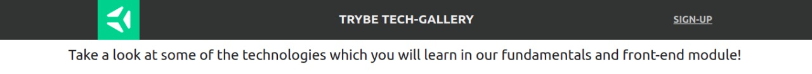

## Exercícios

**index.html**
**1.** Teste as possibilidades ( *row* , *column* , *row-reverse* e *column-reverse* ) para a propriedade *flex-direction* 

**2.** Teste as possibilidades ( *wrap* e *nowrap* ) para a propriedade *flex-wrap* .

**3.** Teste as possibilidades para a propriedade *flex-flow* .

**index2.html**
**4.** Teste as possibilidades ( *center* , *flex-start* , *flex-end* , *space-around* e *space-between* ) para a propriedade *justify-content*

**index3.html**
**5.** Teste as possibilidades ( *center* , *flex-start* , *flex-end* , *stretch* e *baseline* ) para a propriedade align-items .

**index4.html**
**6.** Teste as possibilidades ( *center* , *flex-start* , *flex-end* , *stretch* , *space-around* e *space-between* ) para a propriedade *align-content* .

---

## Exercícios 2 - tech-gallery.html tech-gallery.css

**1.** Crie um cabeçalho para sua aplicação utilizando a tag `header`. Este cabeçalho *deve* possuir 3 elementos e estes devem ser posicionados utilizando *Flexbox*. O resultado deverá ser similar à estrutura da página "Trybe Tech-Gallery". Observe os exemplos abaixo:

**2.** Implemente o conteúdo da primeira `section`. Esta seção deverá conter no mínimo um elemento de texto. Utilizando *Flexbox*, faça o posicionamento de acordo com o exemplo abaixo.

**3.** Implemente o posicionamento da segunda `section`. Esta seção deverá conter  no mínimo 6 imagens e um título para cada uma delas. Sinta-se livre para usar a imaginação e selecionar as imagens que preferir, só não esqueça de seguir a estrutura de posicionamento proposta.

**4.** Por fim, faça o posicionamento do *footer/rodapé*, este é o ultimo elemento necessário para que nossa aplicação fique completa. O rodapé *deverá* conter no mínimo 2 elementos. Para o exemplo, foram adicionadas imagens que redirecionam o usuário para as redes sociais da Trybe.
