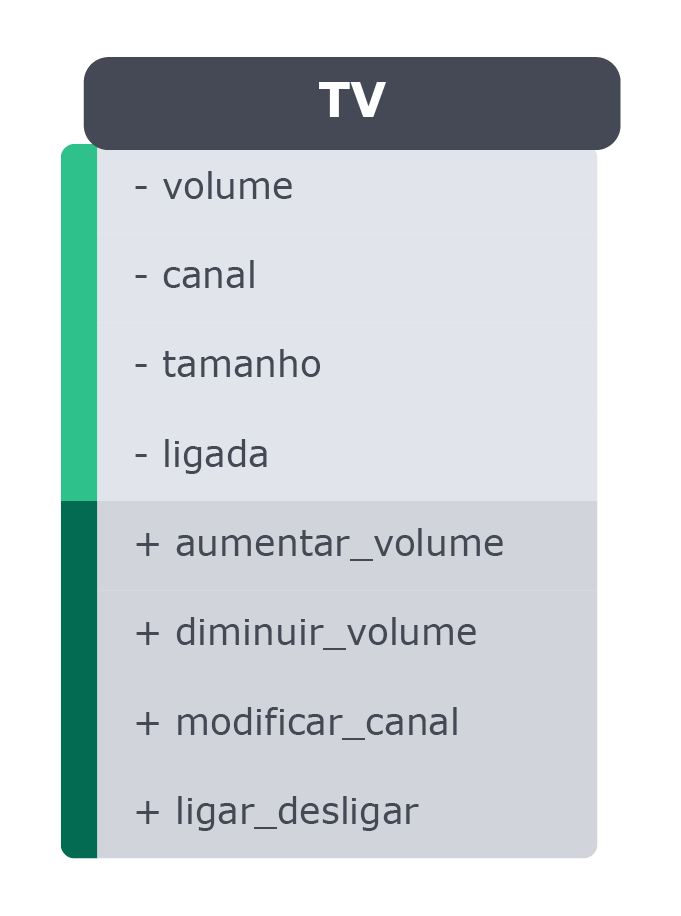
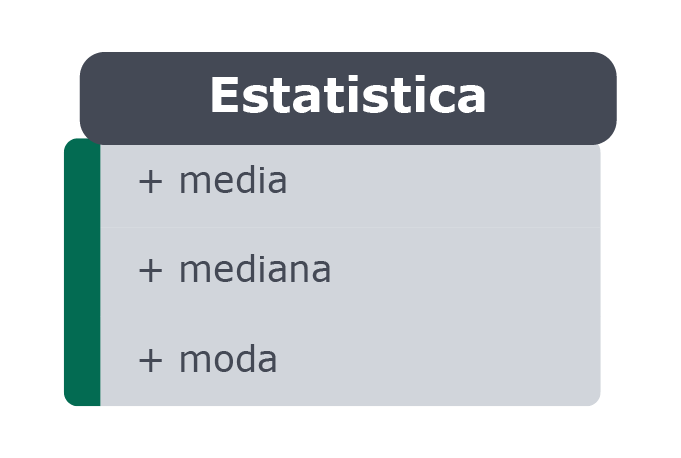
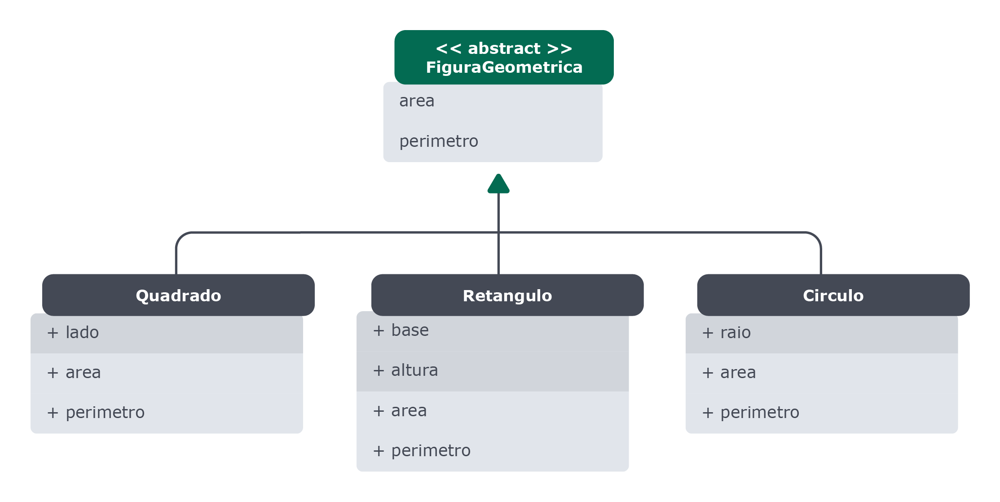

## Exercícios

**exercise1.py**
**1.** Além do liquidificador, podemos modelar inúmeros eletrodomésticos, tais como: geladeira, batedeira, micro-ondas, fogão e etc.
Para fixar crie uma classe do objeto geladeira, e semelhante ao exemplo do liquidificador
Em seguida faça com que a pessoa tenha uma geladeira como atributo através da *composição*.
Crie também um método *comprar_geladeira*,
Faça com que o print *(__str__)* de Pessoa informe se sua instância possui ou não uma geladeira.

**exercise2.py**
**2.** Implemente a classe *Microondas*, *Batedeira* e *Fogão*, sempre herdando da classe *Eletrodoméstico* e para testar, instancie as novas classes e realize alguns prints, como por exemplo, divulgando o preço do Eletrodoméstico.

**exercise3.py**
**3.** Vamos implementar o diagrama abaixo:



Atributos:
* *volume* - será inicializado com um valor de 50 e só pode estar entre 0 e 99;
* *canal* - será inicializado com um valor de 1 e só pode estar entre 1 e 99;
* *tamanho* - será inicializado com o valor do parâmetro;
* *ligada* - será inicializado com o valor de False, pois está inicialmente desligado.

Todos os atributos devem ser privados.

Métodos:
* *aumentar_volume* - aumenta o volume de 1 em 1 até o máximo de 99;
* *diminuir_volume* - diminui o volume de 1 em 1 até o mínimo de 0;
* *modificar_canal* - altera o canal de acordo com o parâmetro recebido e deve lançar uma exceção *(ValueError)* caso o valor esteja fora dos limites;
* *ligar_desligar* - alterna o estado da TV entre ligado e desligado *(True/False)*.

**exercise4.py**
**4.** Defina uma classe *Estatistica* que calcule média, mediana e moda de uma lista de números.



**exercise5.py**
**5.** Lembra do exercício dos gráficos? De semelhante modo, vamos implementar os objetos das seguintes figuras geométricas?



**exercise6.py**
**6.** Implemente um sistemas de logs por nível de severidade, seguindo o diagrama abaixo.


**Classe Log**
Atributos:
* *manipuladores* - Será inicializado com um conjunto de subclasses de ManipuladorDeLog;

Métodos:
* *adicionar_manipulador* - adiciona um manipulador ao conjunto de manipuladores do gerenciamento de logs *(Log)*;
* *info* - dispara logs com nível de severidade *"INFO"*;
* *alerta* - dispara logs com nível de severidade *"ALERTA"*;
* *erro* - dispara logs com nível de severidade *"ERRO"*;
* *debug* - dispara logs com nível de severidade *"DEBUG"*;
* *__log* - dispara os logs formatados para todos os manipuladores (invocado para cada nível de severidade, para evitar duplicação de código);
* *__formatar* - formata os logs de acordo com o padrão "[ERRO - 01/01/2020 13:00:00]: ZeroDivisionError: division by zero";
A interface de manipulação de logs deve utilizar métodos de classe.

**exercise7.py**
**7.** Em um sistema de compras online, temos um código que efetua a compra do pedido. Este código possui code smells e precisa ser refatorado. Qual é o code smell? Efetue a refatoração do código.
```sh
    class Order:
        def __init__(
            self,
            items,
            credit_card_name,
            credit_card_number,
            credit_card_month,
            credit_card_year,
            credit_card_security_code,
        ):
            self.items = items
            self.credit_card_name = credit_card_name
            self.credit_card_number = credit_card_number
            self.credit_card_month = credit_card_month
            self.credit_card_year = credit_card_year
            self.credit_card_security_code = credit_card_security_code

        # ...
```